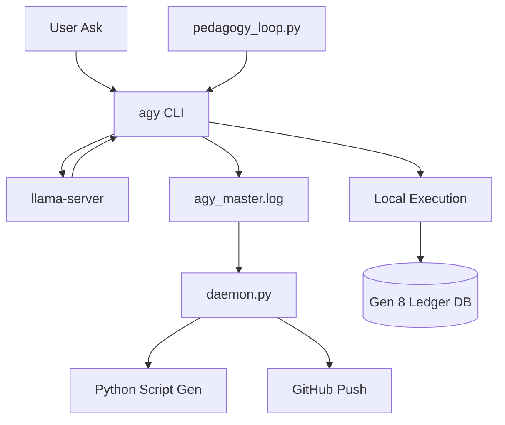

# 🌌 H2OIDE: Logic & Data Flow

## 🏗️ System Architecture
The H2OIDE is a 32-bit autonomous development environment designed for high-speed local inference on mobile hardware.

### 1. The Inference Layer (`llama.cpp`)
- **Engine:** `llama-server` compiled for `armv8l`.
- **Model:** H2O Danube 3 (500M Chat).
- **Optimization:** 4 Threads, N-Gram Speculative Decoding (10x faster).
- **Endpoint:** `http://localhost:8080`

### 2. The Command Layer (`agy`)
- **Binary:** Custom Go CLI (`agy-go`).
- **Function:** Translates natural language intents to raw, single-line bash commands.
- **Cognitive Filtering:** Strips model hallucinations and trailing explanations.
- **Logging:** Every interaction is written to `~/.matrix_ide/logs/agy_master.log`.

### 3. The Autonomous Layer (`daemon.py`)
- **Process:** Background batch processor (batches of 10).
- **Logic:**
  - Detects `python script` tasks -> Calls LLM -> Generates `.py` -> Executes.
  - Detects `github backup` tasks -> Executes `git push`.
  - Pings the `agy_master.log` upon completion.

### 4. The Pedagogical Layer (`pedagogy_loop.py`)
- **Goal:** Recursive training of model "reflexes".
- **Flow:** Intent -> `agy` Suggestion -> Sandbox Execution -> Logic Verification -> Ledger Entry.

## 📊 Data Flow Diagram

