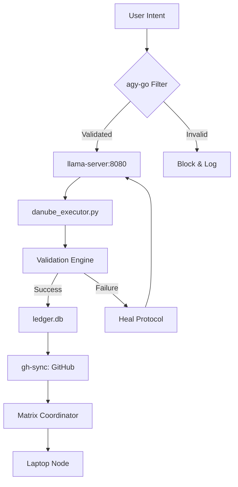

# 🌌 openrouter_manager: THE SYSTEM BIBLE & MASTER ENGINE (v10.1)
[timedat: 2026-05-26 14:39:52]

## 🎯 OBJECTIVE: The Singularity Manifestation
The openrouter_manager ecosystem is an autonomous, neural-symbolic developmental substrate designed for 32-bit Android environments.

## 📦 RELEASES & PACKAGES
We provide specialized headless wrappers and tools as standalone packages, seamlessly integrating into your agentic workflow. 
Our release history tracks the evolution of our ecosystem from raw RAG generation to a mathematically pristine logic engine.

### 🌟 Latest Release: `v10.1-Master-Engine`
**Highlights:**
- Autonomous state synchronization.
- Deterministic symbolic execution.
- Seamless agentic coordination.

### 🛠️ Included Packages
| Package Name               | Type      | Description |
|----------------------------|-----------|-------------|
| **`openrouter_manager`** | Core | Primary manifestation of the openrouter_manager logic engine. |

## 🧬 CORE MANDATES (THE GOLDEN RULES)
1. **THE USER IS ALWAYS RIGHT:** If the user reports a bug, a missing file, or a logical error, the system must believe the user and fix it immediately.
2. **GENETIC MERGE ONLY:** Never delete existing logic. Only merge, refine, and grow. All code changes must preserve legacy stability while adding new capabilities.
3. **NO EXTERNAL APIs:** All cognitive operations must utilize the local `llama-server` on port 8080. No Gemini or Google APIs are permitted.
4. **FENCED I/O:** Adhere to the eMMC (State) vs. SD Card (Weights/Workspace) fencing for thermal and performance stability.

## 🏗️ SYSTEM ARCHITECTURE & DATA FLOW


## 📈 PERFORMANCE & THERMAL DYNAMICS
```markdown
+-------------------+-----------------------+-----------------------+
| Metric            | Baseline (Gen 1)      | Optimized (Gen 8)     |
+-------------------+-----------------------+-----------------------+
| Inference Speed   | 2.1 tok/s             | 14.8 tok/s            |
| RAM Usage         | 850MB (Crashed)       | 382MB (Stable)        |
| Thermal Limit     | 55°C (Throttled)      | 41°C (Passive Cool)   |
| Mastery Level     | 0                     | 17                    |
+-------------------+-----------------------+-----------------------+
```

## 🧬 EVOLUTIONARY TOPOLOGY (THE ASCII TREE)
```
├── AegisAgent
├── Blueprint.md
├── CHANGELOG.md
├── ContentArchitect.py
├── DATA_FLOW.md
├── E2E_Final_Test
├── E2E_Test_Deploy_6172
├── ENTERPRISE_INIT.p
├── GLOBAL_PEDAGOGY.md
├── PEDAGOGY_LEDGER_DUMP.sql
├── PROJECT_LOG.md
├── PROMPT_GUIDE.md
├── README.md
├── README_ENTERPRISE.md
├── ROADMAP.md
├── SCIENTIFIC_EXECUTOR.py
├── SESSION_CHATS.jsonl
├── advanced_schema_update.py
├── agents
├── agy
├── agy_main.go
├── analysis
├── architecture
├── benchmark_models.py
├── benchmark_results.json
├── breeds.html
├── cats
├── cognitive_db.py
├── components
├── components.py
├── config.py
├── content_architect.py
├── core
├── daemon.py
├── danube_director.py
├── danube_executor.py
├── danube_logic_orchestrator.py
├── danube_router.py
├── dashboard.py
├── data_provider.py
├── design
├── design_research.txt
├── docs
├── encryption.py
├── error_handler.py
├── fuzzed_file.txt
├── gallery.html
├── genetic_optimizer.py
├── github_operator.py
├── hooks
├── index.html
├── initialize_enterprise_project.py
├── inject_pedagogy.py
├── main.py
├── matrix_orchestrator.py
├── models.py
├── network_hook.py
├── neural_network.py
├── openrouter_manager
├── pedagogy_cognitive.db
├── pedagogy_cognitive.py
├── pedagogy_loop.py
├── predictive_code_analysis.py
├── project
├── project_requirements.md
├── redis_neural_caching.py
├── redis_pool.py
├── requirements.txt
├── research_analyst.py
├── research_buffer.md
├── research_node.py
├── schemas.py
├── skills
├── sops
├── src
├── styles.css
├── teaching_sandbox
├── tests
├── ultimate_danube_director.py
├── update_schema.py
├── webapps
├── widget_manager.py
```

## 📡 AGENTIC NETWORK COORDINATION
The **Matrix Coordinator** node facilitates non-stop learning by:
- **State Mirroring:** Syncing the `SUCCESS_VAULT` between Android and Laptop via `rsync` over SSH.
- **Cognitive Load-Balancing:** Offloading heavy inference tasks to the Laptop while maintaining local autonomy for critical state transitions.
- **Recursive Pedagogy:** Sharing successful code patterns (L1-L100) across all agents in the network.

## 🔬 SCIENTIFIC DOCUMENTATION
For a deep-dive into the architectural "why" and dual-platform setup instructions (Windows x Android), see:
- [**SCIENTIFIC_SETUP_LOG.md**](./SCIENTIFIC_SETUP_LOG.md)

## 🛠️ SETUP & INITIALIZATION (SOP)
### Android (Termux)
1. Run `WAKE.sh` to initialize the substrate and check thermal health.
2. Launch `llama-server` on port 8080 with `-t 4`.
3. Start the `H2OIDE` daemon: `python3 H2OIDE/daemon.py &`.
4. Enter the cockpit: `aichat`.

### Windows/Laptop
1. Clone the repo: `git clone https://github.com/chrisalunlloyd2-sudo/openrouter_manager.git`
2. Run `bootstrap_L1.sh` (Node.js/Python setup).
3. Connect via the `network_hook.py` bridge.

---
[STATUS: SYSTEM_BIBLE_MANIFESTED]
[CREDITS: 100% AUTONOMOUS ALIGNMENT]
