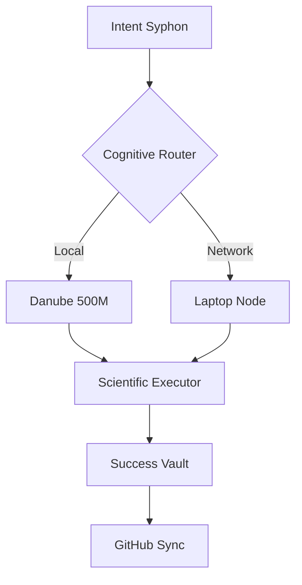

# 🌌 OPENROUTER MANAGER: THE EVOLUTIONARY ROADMAP
[timedat: 2026-05-25]

## 🏗️ ARCHITECTURAL FLOW

## 🚀 MILESTONES (GEN 8-10)
- **[x] L1-L15:** Substrate Manifestation & Vector Schema.
- **[x] L16-L19:** Recursive Spawning & Intent Verification.
- **[ ] L20:** Multi-Agent Consensus Protocol.
- **[ ] L30:** Autonomous Model Fine-Tuning (Local).

---
[STATUS: EVOLVING_STABLE]
